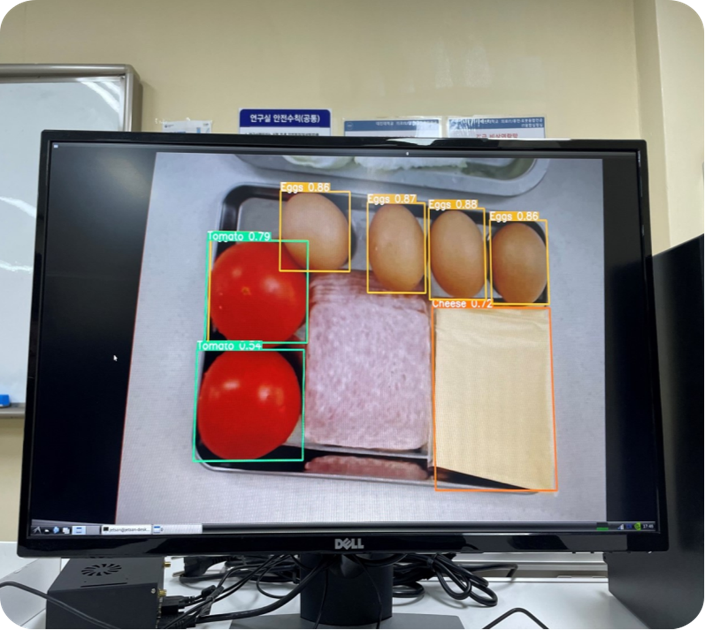
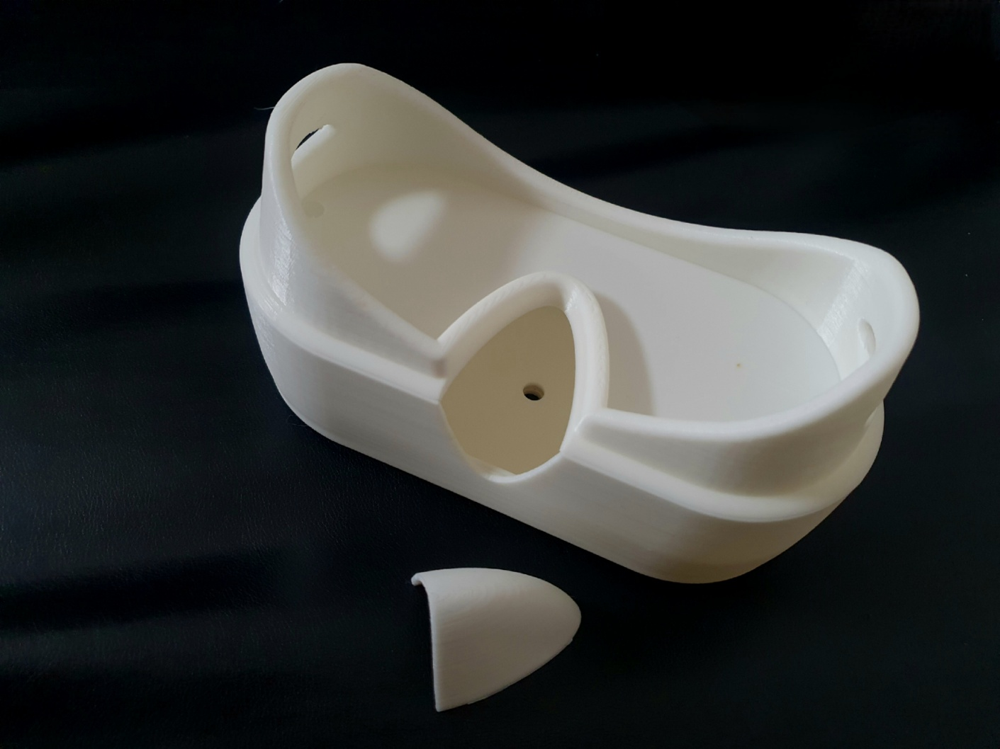
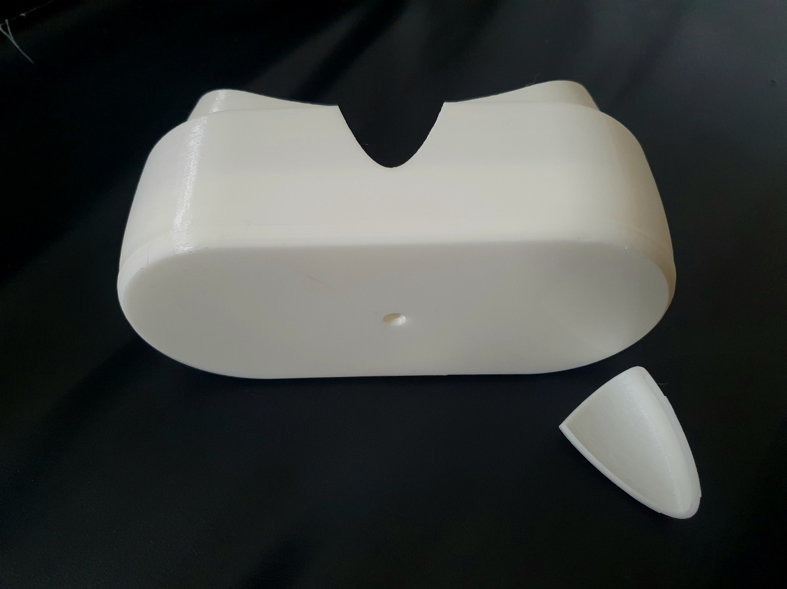

# 시각장애인용 요리 보조 안경 (YOLO 기반)

대학교 졸업작품(캡스톤 디자인)으로 제작한 프로젝트입니다. 시각은 인간 감각 수용체의
약 70%를 차지하는 가장 중요한 감각이지만, 시각장애인은 그 정보의 부재로 스스로 요리하는
데 어려움을 겪습니다. 이에 안경에 부착한 카메라 영상을 YOLO로 분석해 조리대 위 재료를
인식하고, 사용자가 음성으로 "빵 어디 있어?"라고 물으면 화면 기준으로 몇 시 방향에 있는지
음성으로 안내함으로써, 타인의 도움 없이도 자율적으로 요리할 수 있도록 하는 것을
목표로 했습니다.


*실제 젯슨나노 화면에 라이브로 뜬 YOLOv5 탐지 결과입니다 — 토마토/계란/치즈를 실시간으로 인식하고 있습니다.*

## 이 저장소에 대해

원본 프로젝트는 Jetson Nano + Raspberry Pi 두 대의 임베디드 보드에서 동작했는데, 두 보드
모두 하드웨어 오류가 발생하면서 실제 구동 환경과 최신 실행 이력을 잃어버렸습니다. 다행히
개발 과정에서 남겨둔 소스 코드 사본이 남아있어, 그것을 다시 분석해서 이 저장소로
정리했습니다.

**정리 원칙**: 실제로는 동작하지 않았던 부분을 동작하는 것처럼 꾸미지 않았습니다. 검증
가능한 핵심 기능(`jetson/`, `pi/`)과, 개발 과정에서 시도했지만 완성하지 못한 프로토타입
(`experiments/`)을 명확히 구분했습니다. 무엇을 고쳤고 무엇을 원본 그대로 남겼는지는
[docs/KNOWN_ISSUES.md](./docs/KNOWN_ISSUES.md)에 기록했습니다.

## 기술 스택

- **컴퓨터 비전**: YOLOv5 (커스텀 학습, 클래스: hand/bread/cheese/eggs/friedeggs/ham/lettuce/tomato), OpenCV, PyTorch
- **음성 인식**: Google Cloud Speech-to-Text (스트리밍)
- **웨이크워드 감지**: Picovoice Porcupine
- **음성 출력**: espeak-ng TTS, ALSA(aplay) 기반 사전 녹음 음성 재생
- **통신**: Python 표준 `socket` (TCP) — Jetson Nano ↔ Raspberry Pi
- **하드웨어**: Raspberry Pi(카메라 + ReSpeaker 2 Mics Pi HAT, motionEye로 영상 송출 겸 음성 I/O 담당) + Jetson Nano(스트림을 받아 YOLO 연산만 전담)

## 폴더 구조

```
portfolio/
├── jetson/            # 젯슨나노: YOLO 탐지 + 소켓 서버 (검증된 핵심 기능)
├── pi/                # 라즈베리파이: 음성 인식/출력 + 소켓 클라이언트 (검증된 핵심 기능)
├── experiments/        # 개발 과정 중 시도했던 프로토타입/테스트 (미완성, 각 파일에 이유 명시)
├── assets/
│   ├── voice/         # 음성 안내 mp3/wav 에셋
│   ├── photos/        # 실물/실행 화면 사진
│   └── 3d-model/      # 안경 프레임 3D 모델 (Fusion 360 / STEP / STL) + 렌더 이미지
└── docs/
    ├── ARCHITECTURE.md   # 시스템 구성도 및 실제 검증된 흐름 vs 미완성 흐름
    └── KNOWN_ISSUES.md   # 발견한 버그, 보안 스크러빙 내역, 구조적 문제 기록
```

자세한 시스템 흐름은 [docs/ARCHITECTURE.md](./docs/ARCHITECTURE.md)를 참고해 주세요.

## 사진 & 3D 모델

| | |
|---|---|
|  |  |

3D 프린터로 출력한 안경 프레임 실물입니다. 설계 파일(Fusion 360/STEP/STL)과 렌더 이미지는
[assets/3d-model/](./assets/3d-model/)에 있습니다.

YOLOv5 학습/검증 과정을 보여주는 이미지는 [assets/photos/](./assets/photos/)에 정리했습니다
(`yolo-train-batch.jpg`, `yolo-val-batch-labels.jpg`).

## 실행 방법 (재현 시 참고용)

> 실제 장비(Jetson Nano, Raspberry Pi)와 카메라, 커스텀 학습된 YOLOv5 가중치가 있어야
> 동작합니다. 학습된 가중치 파일(`best.pt`)은 하드웨어 오류로 별도 보관하지 못해 이
> 저장소에 포함되어 있지 않습니다 — 클래스 목록(`jetson/config.py`의 `CLASS_NAMES`)을
> 참고해 동일한 클래스로 재학습이 필요합니다.

1. 두 보드 각각에 `requirements.txt`를 설치합니다.
2. 젯슨나노에는 [YOLOv5 저장소](https://github.com/ultralytics/yolov5)를 별도로 clone해둡니다.
3. `.env.example`을 참고해 `.env`를 만들고, 실제 카메라 스트림 주소·젯슨 IP·학습된
   가중치 경로·Google Cloud 인증 파일 경로·Picovoice 액세스 키 등을 채웁니다.
4. 젯슨나노: `python jetson/ingredient_locator_server.py`
5. 라즈베리파이: `python pi/ingredient_locator_client.py`

## 한계점 / 배운 점

- YOLOv5 재료 탐지는 실제 젯슨나노 하드웨어에서 라이브로 동작을 확인했습니다 (위
  스크린샷 참고). 손 기준 상대 위치를 계산해 시계 방향으로 안내하는 아이디어 자체도
  구현했고, Jetson↔Pi 소켓 통신 + Google STT + 음성 안내까지 각 요소 기술은 개별적으로
  동작을 확인했습니다.
- 다만 웨이크워드 감지(Porcupine)까지 포함한 전체 파이프라인을 하나로 묶어 안정적으로
  자동 실행시키는 마지막 통합 단계는 완성하지 못했습니다. 소켓 통신 구조를 다시
  들여다보니 실험적으로 시도했던 버전 중 하나(`experiments/wake_word_assistant.py`)는
  애초에 Jetson·Pi 양쪽이 모두 서버로 동작해 서로 연결될 수 없는 구조였다는 것도 이번
  정리 과정에서 뒤늦게 발견했습니다.
- 이번 정리를 통해 원본에 있던 실제 로직 버그(12시 방향 판정이 항상 실패하던 체이닝
  비교 버그 등)와 하드코딩된 비밀정보(API 키, 인증 경로)를 찾아내 수정/제거했습니다.
